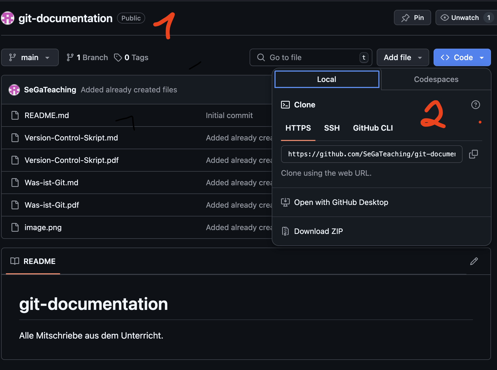

# Git Project Workflow

## Git einrichten

- installieren
git version

## Vorbereitung

### Identität erstellen
check ob Namen und Email in Git config:
```bash
git config --list
```

Namen erstellen:
```bash
git config --global user.name "<Your Name>"
```

Email zu config hinzufügen
```bash
git config --global user.email "<your email address>"
```

## Repository initialisieren
```bash
git init
```
wenn ihr nur diesen Befehl eingebt und nicht vorher Git gesagt habt, dass der Hauptbranch `main` heißen soll wird der Hauptbranch `master`sein.

um das zu ändern müsst ihr NACH des init Befehls folgenden Befehl ausführen:
```bash
git branch -m master main
```

um direkt bei der Initialisierung den Hauptbranch main zu nennen macht folgendes:
```bash
git init -b main
```

Um den Status unseres Neu-erstellten Repositories anzuschauen:
```bash
git status
```

## Datei zu Staging hinzufügen

erstelle Datei test1.txt und füge sie der Staging-Area hinzu:
```bash
git add test1.txt
```
um die Datei wieder aus Staging herauszuholen
```bash
git rm --cached test1.txt
```
Füge test1.txt erneut der Staging-Area hinzu:
```bash
git add test1.txt
```

## der erste Commit

wir commiten jetzt test1.txt
```bash
git commit -m "<your commit message>"
```

## der zweite Commit

wir erstellen eine zweite test2.txt und commiten die mit den selben Schritten wie test1.txt

## Commits anschauen
alle Commits bislang aufzeigen
```bash
git log
```
hier gibt es nun optionen, welche ihr dem log befehl hinzufügen könnt:
- git log --oneline -> alles in einer Zeile
- git log --pretty=oneline

## Änderungen am Code
wir fügen zu test1.txt nun einen Text / Inhalt hinzu
```bash
git status
```
zeigt nun, dass test1.txt geändert/modified wurde.
wir können nun ganz normal mit `git add text1.txt` und `git commit...` anschließend commiten.

um die Änderungen einer Datei mit dem letzten Stand der Datei vom letzten Commit abzugleichen
```bash
git diff
```
die Ausgabe kann folgendermaßen aussehen
`@@ -0,0 +1 @@` = gelöschte Zeilen, geänderte Zeilen, hinzugefügte Zeilen


## Branching

um neue Features zu implementieren oder zu testen generieren wir einen neuen 'Branch' der erst einmal unabhängig vom 'main' Branch ist

```bash
git branch <nameOfNewBranch>
```
um zu dem neuen Branch zu wechseln muss ich folgendes machen:
```bash
git checkout <nameOfBranch>
```
mit `git branch` zeigt mit der Output der Konsole alle existierenden Branches in meinem Repository und markiert den aktuellen Branch mit '*'

### Neuen Branch kreieren und direkt dahinwechseln

```bash
git checkout -b <nameOfBranch>
```

### optionale Methode um den Branch zu welchseln (angebl. Idiotensicherer)
```bash
git switch <BranchName>
# wechseln und gleichzeitig einen neuen Branch generieren
git switch -c <NewBranchName>
```


### Branch löschen

um einen Branch löschen wechsele erst in einen anderen Branch mit `git checkout` und gib folgenden Befehl ein
```bash
git branch -d <branchName>
```

## Erster Merge

```bash
git merge <BranchYouWantToMergeIn>
```

## Have a look at the Past
Du kannst mit Git dir den Zustand Deines Projets zu jedem x-beliebigen Commit-Zeitpunkt nochmals anschauen
```bash
git checkout <hashOfThePastCommit>
```
um wieder zurück in die Gegenwart zu kommen
`git checkout main`

## Projekt zurücksetzen
manchmal möchtest Du Änderungen verwerfen und zu einem früheren Zeitpunkt Deines Projetes zurückkehren, nicht nur um zu schauen wie zu dem Zeitpunkt aussah, sondern um von dem Zeitpunkt aus neu zu starten
```bash
git reset --hard <hashOfPastCommit>
```

## Create Pull Request (wenn Du im Team arbeitest)
Ich kreiere lokal ein neues Feature für das Projekt. 
- Dazu erstellen wir erste einen neuen Branch auf welchem wir das Feature entwickeln.
- wir pushen dann das fertige Feature (also wenn commited) zu GitHub
- unsere Kollegen können daraufhin dieses neue Feature testen
- Wenn Feature okay wird es auf GitHub in den Main-Branch übernommen
- Anschließen ziehe ich mir aus GitHub den akutellen Main-Branch auf meinen lokalen Main-Branch damit diese wieder den selben Stand haben

---------- Lokales Repository ----------
1. erstellen eines neuen Branches
   ```bash
   git checkout -b feature2
   ```
2. wir kreieren 'main.py' und schreiben eine kurze For-Schleife
3. Füge die neue Datei zu Staging
   ```bash
   git add main.py
   ````
4. committen main.py zum lokalen feature2 Branch repository
   ```bash
   git commit -m "main.py erstellt, schließlich machen wir Python"
   ```
5. pushe die Änderungen im 'feature2' Branch nun zu GitHub und erstelle auf GitHub automatisch ebenfalls einen 'feature2' Branch welcher gleichzeitig auf GitHub einen 'Pull-Request' auslöst.
   - Pull-Request ermöglicht es unseren Kollegen meine Änderungen zu überprüfen, testen und zu kommentieren.
   ```bash
   git push origin feature2
   ```

---------- Auf GitHub ----------

1. auf Github seht Ihr nun einen Button 'Compare & pull request'
2. Ansicht um die Änderungen sich anzuschauen, wenn okay -> klicke auf 'Create pull request'
3. Jetzt bekommst Du die Möglichkeit Deine Änderungen auf GitHub mit dem dortigen Main-Branch zusammenzuführen.
(in real live, wenn Du in einer Organisation arbeitest, wird das wohl von Deinem Teamleiter gemacht und nicht von Dir)

---------- Lokales Repositoy ----------

9. das Projekt auf GitHub im Main-Branch ist jetzt aktueller als unser Projekt im Main-Branch. Wir bringen jetzt unseren Main-Branch auf den aktuellen GibHub Main-Branch Stand.
10. checken ob wir lokal uns aktuell auf dem Main-Branch befinden, wenn nicht auf Main-Branch wechseln
11. Im Main-Branch befindend holen wir uns nun die aktuelle Version aus GitHub
    ```bash
    git pull origin main
    ```
12. (optional) aufräumen: lösche unnötige branches
    ```bash
    git branch -d feature2
    ```

## Neues Feature (best way, wenn Du nur für Dich alleine arbeitest - cc Sebastian)

---------- Lokal ----------
1. generiere einen neuen Branch in dem Du Deine Änderungen erstellen und testen möchtest.
   `git switch -c zorro`
2. wir fügen in der 'main.py' ein paar Code-Zeilen hinzu.
3. wir adden und commiten die geänderte 'main.py' im 'zorro' Branch
   ```bash
   git commit -am "Neue Funktion add zu main.py hinzugefügt"
   ```
4. ich teste meine neuen Funktionen jetzt auf Herz und Nieren.
5. wenn ich zufrieden bin und alles funktioniert, möchte ich diese neue Funktion nun in meinen 'Main'-Branch übernehmen bzw. zusammenführen
   ```bash
   # dazu wechsele ich erst in den 'main' branch
   git checkout main

   # Nun merge ich die Änderungen aus dem 'zorro' Branch mit meinem 'main' Branch
   git merge zorro
   ```

6. ich möchte meine aktuelle Version meines Projektes nun auch zu meinem  persönlichen GitHub Repo pushen
   ```bash
   git push origin main
   ```

## Existierendes GitHub Repo klonen mit HTTPS

1. Gehe zum GitHup Repo welches Du klonen bzw. kopieren möchtest
2. Klicke auf Code und wähle 'HTTPS' und kopiere die dortige URL
   

3. auf Deinem lokalen Computer gehe zum Verzeichnis, in welches das neue Repo als Ordner gespeichert werden soll.
   ```bash
   cd /path/to/dirctory
   ```
4. füge die kopierte URL nun in folgenden Befehl ein, um das GitHub Repository auf Deinen Computer zu klonen
   ```bash
   git clone <URL/to/GitHub/Repository>
   ```
5. wechsle nun in das Verzeichnis des geklonten GitHub Repositories
   ```bash
   cd <Repository-Name>
   ```